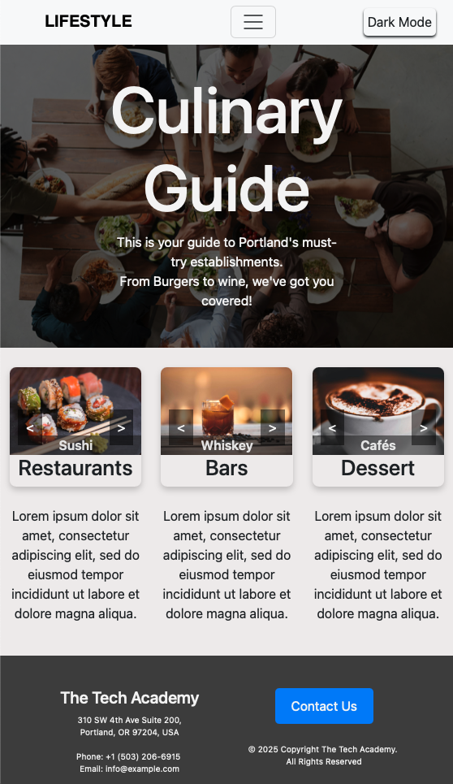

<!DOCTYPE html>
<html>
<head>
  <mata charset="UTF-8"></mata>
  <meta name="viewport" content="width=device-width, initial-scale=1">
 </head>
<body>
<h1 id="Introduction">Front-end Web Development Live Project</h1>
<h2>Introduction</h2>

My time at the <a href="https://www.learncodinganywhere.com">Tech Academy</a> included an internship with <a href="https://www.linkedin.com/company/prosper-it-consulting/">Prosper IT Consulting</a>, during which I 
participated in a 2-week sprint.
 This hands-on experience included Agile/Scrum practices including:  
 participating in daily stand-ups, a sprint retrospective, and using Azure DevOps to complete stories. 
 I was tasked with creating a “Lifestyle” brand website that’s meant to focus on an area’s food scene. 
 During this project, I used HTML, CSS, and JavaScript techniques learned through coursework. 
 I then expanded my knowledge by taking on new web-development concepts for this apprenticeship. 
 I finished the first project three days ahead of schedule and was assigned a second project called "Cookery."

Below you will find two sections of stories for the projects I worked on. This first is for the LifeStyle 
website, and the second is for a site called “Cookery”. With each description, you will find sections of 
code, photos and gifs of site elements.

<h2 id="contents">Table of Contents</h2>
<ul>
<li><a href="#lifestyle">LifeStyle (Culinary Guide)</a></li>
<li><a href="#cookery">Cookery</a></li>
</ul>
<h2 id="lifestyle">LifeStyle Stories</h2>
<ul>
  <li><a href="#Component">Creating Your Component</a></li>
  <li><a href="grid">Implement a grid system</a></li>
  <li><a href="form">Create a signup form</a></li>
  <li><a href="topbutton">Back To Top Button</a></li>
  <li><a href="dark">Creating a Dark Theme</a></li>
  <li><a href="responsive">Make your Page Responsive</a></li>
  <li><a href="animation">Create an Animation Feature</a></li>
</ul>
<h2 id="Component">Creating Your Component</h2>
In this story, I set up the basics of the website. I created component folders for style and script files, and images for the site.  Then I laid out my landing page with basic HTML which included:
Meta data, links to Bootstrap, CSS stylesheet, JavaScript, etc.
Body with navbar, footer, and background color. 
Hero Banner / Header photo with text overlay   
Go back to <a href="#contents">Table of Contents</a> of jump down to <a href="#cookery">Cookery</a>.

<h2 id="grid">Implement a grid system</h2>
In this story, I created a grid layout using Bootstrap. I added basic content to my layout, including three carousels on the same row. I also added a smooth scrolling effect to the page. 
  

Go back to <a href="#contents">Table of Contents</a> of jump down to <a href="#cookery">Cookery</a>.

<h2 id="form">Create a signup form</h2>
Here I created a working popup contact form using Formspree. It sits at the bottom of the page in the footer and was styled using Bootstrap and CSS properties. I also implemented JavaScript to prevent Formspree from loading a new page once the submit button is clicked.   

Go back to <a href="#contents">Table of Contents</a> of jump down to <a href="#cookery">Cookery</a>.

<h2 id="topbutton">Back To Top Button</h2>
I was then tasked with creating a “back to top” button that sits fixed on the screen so when you scroll, the button will not move.  This task required the use of a Javascript function that gets called when the button is clicked and moves the user back to the top of the page. This also has a second function that gets called when the scroll bar moves. It uses console.log inside the function to test that it's getting called.  It also includes a logic statement to show the button when the scroll bar is at the bottom of the page, otherwise it remains hidden. 
  
Go back to <a href="#contents">Table of Contents</a> of jump down to <a href="#cookery">Cookery</a>.

<h2 id="dark">Creating a Dark Theme</h2>
This story is the one I found most challenging. I struggled to get dark mode to apply to all elements at the same time. Eventually I realized I was grouping too many elements together in CSS, which was preventing dark mode from being applied to them. Once this was resolved, all elements added after this point easily had dark mode applied. 
  
Go back to <a href="#contents">Table of Contents</a> of jump down to <a href="#cookery">Cookery</a>.

<h2 id="responsive">Make your Page Responsive</h2>
In this story I worked on making my page responsive so it is viewable on other devices like tablets, phones. In addition to what Bootstrap already had implemented, I added CSS media queries for various elements that would not have been included or had stylings overwritten. This is where I learned which parts of the site were not as responsive as I initially thought. For example, when viewed on smaller screen sizes, my navbar began to cut off part of my “header” text. I then went back to check both the navbar and header container to see where the problems are and adjust accordingly. 
 
 

This is also where I built and refined my mobile menu. Originally it was taking up the whole page, but after reading up on mobile menu design “best practices”, I reduced the width so the user can partially see where they are on the page.   

 
Go back to <a href="#contents">Table of Contents</a> of jump down to <a href="#cookery">Cookery</a>.

<h2 id="animation">Create an Animation Feature</h2>
Here I created a basic text animation using HTML & CSS.   

Go back to <a href="#contents">Table of Contents</a>.

<h2 id="cookery">Cookery Stories</h2>
<ul> 
  <li><a href="#variables">Create CSS Variables & Import Google Font API’s</a></li>
  <li><a href="#navbar">Create a Navigation Menu</a></li>
  <li><a href="#mobile">Change Mobile Menu Icon</a></li>
  <li><a href="#trigger">Add Hover Trigger – Food Dropdown Menu</a></li>
  <li><a href="#TextColor">Update Navigation Text Color</a></li>
  <li><a href="#hero">Create Hero Banner</a></li>
  <li><a href="#shrink">Navigation Bar Sticky & Shrink On-Scroll</a></li>
  <li><a href="#search">Search Bar Creation & Placement (Non-working)</a></li>
  <li><a href="#recipe">Create Featured Recipe Section</a></li>
  <li><a href="#update">Update Featured Recipe</a></li>
</ul>
<h2 id="variables">Create CSS Variables & Import Google Font API’s</h2>
This story involved researching and then creating root variables for CSS. I was excited to learn more about this as we briefly went over it in classwork and I then encountered it while researching and debugging in the LifeStyle website. We imported fonts from Google Fonts, something I was familiar with since we frequently used it in practice during our CSS drills. 
  

  
  

Go back to <a href="#contents">Table of Contents</a> or back to top of <a href="#cookery">Cookery</a>.

<h2 id="navbar">Create a Navigation Menu</h2>
Here we had to create a Navigation Menu with a submenu using bootstrap. I then further styled it following the client parameters which included a dropshadow on the navbar, background and text colors, navbar height, font size and weight, and removing the down arrow from the submenu.
  

  
  
  

Go back to <a href="#contents">Table of Contents</a> or back to top of <a href="#cookery">Cookery</a>.

<h2 id="mobile">Change Mobile Menu Icon</h2>
This was a minor change the client asked for - changing the color of the mobile menu icon to match the site’s main background color. 
  
Go back to <a href="#contents">Table of Contents</a> or back to top of <a href="#cookery">Cookery</a>.

<h2 id="trigger">Add Hover Trigger – Food Dropdown Menu</h2>
This was another client change where they asked to add a hover trigger to the dropdown menu. 
  
Go back to <a href="#contents">Table of Contents</a> or back to top of <a href="#cookery">Cookery</a>.

<h2 id="TextColor">Update Navigation Text Color</h2>
Here the client wanted the text color on the navigation to change to the main-color  
when they hover their mouse over each link.
  
Go back to <a href="#contents">Table of Contents</a> or back to top of <a href="#cookery">Cookery</a>.

<h2 id="hero">Create Hero Banner</h2>
In this story I created a Hero banner with text to the left of the screen and image to the right. The main parameter  was to have the photo touch the bottom of the Navbar and edge of the page. While I was able to make the visual design work, I struggled with the responsiveness of this element after I implemented the styling changes. 
  
Go back to <a href="#contents">Table of Contents</a> or back to top of <a href="#cookery">Cookery</a>.

<h2 id="shrink">Navigation Bar Sticky & Shrink On-Scroll</h2>
Here I ensured the navigation bar stays at the top of the page, but shrinks when the user scrolls down the page. This required the use of Jquery.
  

  

Go back to <a href="#contents">Table of Contents</a> or back to top of <a href="#cookery">Cookery</a>.

<h2 id="search">Search Bar Creation & Placement</h2>
In this story I created a recipe search bar. This is strictly the search input and the bar it sits in. We were specifically told not to add any icons or function yet. 
The styling parameters were as follows:
Search bar background color white, opacity 80%
Box shadow 0 0 19 -2 black opacity 25%
This element required creating a second row in the hero banner. To achieve the desired outcome, I worked on the position and margins. 
  

  
  

Go back to <a href="#contents">Table of Contents</a> or back to top of <a href="#cookery">Cookery</a>.

<h2 id="recipe">Create Featured Recipe Section</h2>
The client wanted a featured recipe section that showcased a photo of the finished recipe, a brief description of the recipe, a button to view the recipe, and a bar at the bottom of the recipe car that holds social icons. Here I utilized Bootstrap Cards and Font Awesome. I again struggled with responsiveness here too, but ultimately I ran out of time. I plan to continue playing with this outside of my internship and will update later. 
  

  
  
  

Go back to <a href="#contents">Table of Contents</a> or back to top of <a href="#cookery">Cookery</a>.

<h2 id="update">Update Featured Recipe</h2>
In this story update, the client wanted to add a hover effect to the “view recipe” button on the featured recipe card. The background color changes from green to grey when hovered over. 
  

Go back to <a href="#contents">Table of Contents</a> or back to top of <a href="#cookery">Cookery</a>.

<h2>Other Skills Learned</h2>
Utilizing Azure DevOps and Git for version control. 
Experienced a Scrum environment by participating in daily stand-ups and a sprint retrospective. 
Further enhance ability to research unfamiliar concepts and material.  
Further enhanced problem-solving skills through identifying and resolving errors.    
Go back to <a href="#Introduction">Top</a>.
</body>
</html>
